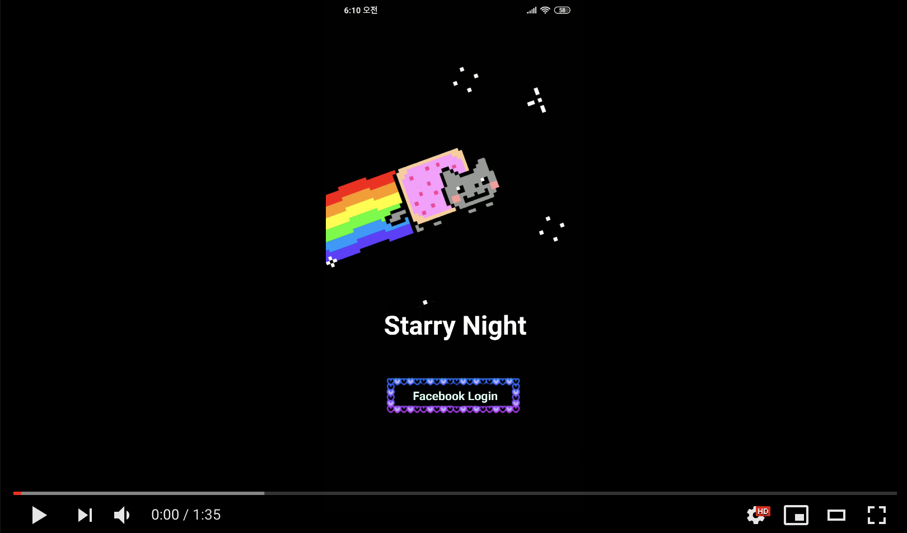

# Starry Night
[](https://youtu.be/g6O58_y4pnM)


애플리케이션내에서 그림을 그린 후 사용자와 그림을 공유하는 안드로이드 애플리케이션입니다
사용자가 그림을 그리면 지도에 별모양의 마커로 저장되며 일주일을 기준으로 마커를 선으로 이어 별자리 모양으로 만듭니다.
지도내의 별모양 마커를 클릭시 다른 사용자의 그림을 볼 수 있습니다.

## Installation

#### Client

```
git clone git clone https://github.com/yami03/starry-night-client.git
cd starry-night-client
npm install
expo start
```

#### Server

```
git clone https://github.com/yami03/starry-night-server.git
cd starry-night-server
npm install
npm start
```

로컬에서 실행시 /.env 파일이 필요합니다.

```
NODE_ENV=development
DATABASE_URI
TOKEN_SECRET_KEY
SESSION_SECRET
```

- DATABASE_URI: Mongodb와 연결할 connection string
- TOKEN_SECRET_KEY: JsonWebToken에 사용되는 시크릿 키
- SESSION_SECRET: session에 사용되는 시크릿

## Features

* Facebook 로그인 기능
* JSON Web Token Authentication
* svg를 이용하여 그림 그리기
* svg path를 stack으로 쌓아서 이전과 앞으로 돌리기 기능
* 그림을 저장시 map에서 위치로 별모양 마커로 저장
* 일주일을 기준으로 사용자의 그림은 마커끼리 선으로 이어 별자리 모양으로 구현
* 나의 현재위치에서 10000미터 거리에 있는 그림만 확인 가능
* 내 그림목록에서 모든 그림 확인 가능

## Skills

#### Client-Side

* ES2015+
* React Native
* Expo
* React Navigation
* React Native Gesture Handler
* React Native Maps
* React Native Svg
* Styled Components

#### Server

- Node.js
- Express
- ES2015+
- JSON Web Token Authentication
- MongoDB
- Mongoose

## Challenges

* 가장 중요한 기능인 그림그리기 기능에서 가장 많은 시간을 소비하였습니다. 그림그리기 구현은 처음엔 Expo없이 React Native Sketch Canvas라는 npm 모듈을 이용하였는데 직접 테스트해본 결과 현재는 없어진 React Life Cycle을 사용하여 모듈없이 구현하는 쪽으로 결정하였습니다.

  구현하는 방법은 Canvas와 Svg를 통해 그림그리는 기능을 구현할 수 있었는데 Canvas는 Expo에서 사용할 수 없었고 Svg는 Expo에서 사용이 가능했습니다.
  React Native보다 더 많은 기능들을 내장되어 있는 Expo를 사용하는게 짧은 시간인 2주내의 구현하기에 적합하다 생각하여 Svg로 구현하게 되었습니다.

  지금까지 Web만 구현하여 Click이나 Drag 이벤트가 익숙하였는데 React Native에서 사용하는 Gesture Handler에 대한 새로운 개념을 익히게 되었습니다.

## Things to do

* 다른 유저의 그림에 좋아요 누르기
* 색칠하기만 하면 되는 컬러링 기능

#### Sincere Thanks

[Vanilla Coding](https://github.com/vanilla-coding)


